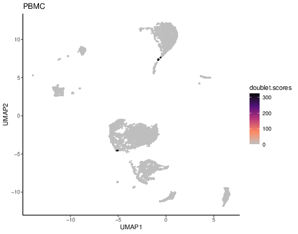

```{r, include=FALSE}
knitr::opts_chunk$set(
  collapse = TRUE,
  comment = "#>"
)
```

# What is arbalist?

Arbalist is designed to perform scATAC-seq analysis using similar methods to [ArchR](https://www.archrproject.com/) but utilizing `MultiAssayExperiment` and the bioconductor framework instead of the ArchR framework. The backend of arbalist is based on the C++ representation in the [tatami library](https://github.com/tatami-inc).

## Arbalist vs ArchR

Most arbalist functions have the same name as the ArchR functions for ease of switching between the two frameworks. However, the results might be slightly different due to differences and choices in implementation.

One key example of the differences between arbalist and ArchR is how the tile matrix is created. Arbalist counts the overlap with the start/end positions of each fragment, not the overlap with the fragment interval itself. This is because the fragment start/ends represent the transposase cleavage events, while the fragment interval has no real biological significance. If the start and end for the same fragment overlap different tiles, the counts for both tiles are incremented by 1. This reflects the fact that these positions represent distinct transposase cleavage events for different features. However, if the start and end for the same fragment overlap the same tile, the tile's count is only incremented by 1. This ensures that the count for each entry still follows Poisson noise and avoids an artificial enrichment of even counts. Overall this approach to creating that tile matrix means that the values in the tile matrix are often lower in arbalist results compared to ArchR results and these differences affect results downstream of the tile matrix (basically everything).

# Setting up

```{r, eval=FALSE}
library(arbalist)
library(MultiAssayExperiment)
library(SummarizedExperiment)
library(SingleCellExperiment)
```

## Files

Arbalist works with the results of the 10x cellranger workflows: [Cell Ranger ARC](https://www.10xgenomics.com/support/software/cell-ranger-arc/latest) or [Single Cell ATAC](https://support.10xgenomics.com/single-cell-atac/software/overview/welcome). For this tutorial, we will be analyzing a single-cell ATAC-seq dataset of human peripheral blood mononuclear cells (PBMCs) provided by 10x Genomics. You'll need to download the following files:

1. [fragment file](https://cf.10xgenomics.com/samples/cell-atac/2.1.0/10k_pbmc_ATACv2_nextgem_Chromium_Controller/10k_pbmc_ATACv2_nextgem_Chromium_Controller_fragments.tsv.gz)
2. [filtered feature matrix](https://cf.10xgenomics.com/samples/cell-atac/2.1.0/10k_pbmc_ATACv2_nextgem_Chromium_Controller/10k_pbmc_ATACv2_nextgem_Chromium_Controller_filtered_tf_bc_matrix.h5)
3. [barcode metadata](https://cf.10xgenomics.com/samples/cell-atac/2.1.0/10k_pbmc_ATACv2_nextgem_Chromium_Controller/10k_pbmc_ATACv2_nextgem_Chromium_Controller_singlecell.csv) (optional)
4. [cellranger summary metadata](https://cf.10xgenomics.com/samples/cell-atac/2.1.0/10k_pbmc_ATACv2_nextgem_Chromium_Controller/10k_pbmc_ATACv2_nextgem_Chromium_Controller_summary.csv) (optional)

For our tutorial, the files have the following names:
```{r, eval=FALSE}
fragment.file <- '10k_pbmc_ATACv2_nextgem_Chromium_Controller_fragments.tsv.gz'
filtered.feature.matrix.file <- "10k_pbmc_ATACv2_nextgem_Chromium_Controller_filtered_tf_bc_matrix.h5"
barcode.annotation.file <- "10k_pbmc_ATACv2_nextgem_Chromium_Controller_singlecell.csv"
sample.annotation.file <- "10k_pbmc_ATACv2_nextgem_Chromium_Controller_summary.csv"
```

## Reference sequence lengths

We also need to know the length of the sequences for each chromosome/scaffold in the fragment file. Sometimes arbalist can pull the sequence lengths from the reference files specified in the fragment file's header. However, since we downloaded the files for this tutorial, the link is broken to these file path. We will specify the `seq.lengths` for this tutorial in the package data.

Let's check the fragment header to see what reference is used.
```{r fragment_header, eval=FALSE}
handle <- gzfile(fragment.file, open = "rb")
on.exit(close(handle))
all.headers <- character(0)
chunk <- 100
repeat {
    lines <- readLines(handle, n = chunk)
    header <- startsWith(lines, "#")
    all.headers <- c(all.headers, sub("^# ", "", lines[header]))
    if (length(lines) < chunk || !all(header)) {
        break
    }
}
field <- sub("=.*", "", all.headers)
value <- sub("[^=]+=", "", all.headers)
info <- split(value, field)
fai <- file.path(info$reference_path, "fasta", "genome.fa.fai")
```

If the reference file exist, we can get the sequence lengths from there. However, in this case we are assuming that it's not available to you so we use the human sequence lengths provided by the arbalistIO package. 
```{r seq_lengths, eval=FALSE}
if(file.exists(fai)) {
  fai.info <- read.delim(fai, sep="\t", header=FALSE)[,1:2]
  seq.lengths <- fai.info[,2]
  names(seq.lengths) <- fai.info[,1]
} else {
  seq.lengths <- GRCh38.seq.lengths
}
```

## Creating MultiAssasyExperiment

To start our analysis, we need to create a `MultiAssayExperiment` (MAE). This MAE will contain a tile matrix for 500 bp tiles across the genome. Although we only use a single sample here, each of the arguments for sample name and the files can be a vector and their lengths should all be the same.

```{r, eval=FALSE}
mae <- arbalistIO::createArbalistMAE(
  sample.names = "PBMC",
  fragment.files = fragment.file,
  filtered.feature.matrix.files = filtered.feature.matrix.file,
  barcode.annotation.files = barcode.annotation.file,
  sample.annotation.files = sample.annotation.file,
  seq.lengths = seq.lengths)
```

# Quality control

Quality control of scATAC-seq removes low-quality cells based on:

1. Number of unique nuclear fragments
2. Fragment size distribution. The nucleosome periodicity leads to reduced fragments around 147 bp in length or the length of DNA wrapped around a nucleosome.
3. Signal-to-background represented by the TSS enrichment score. Low signal-to-background is general assumed to indicate dead or dying cells because the DNA is de-chromatinzed which allows for random transposition genome-wide.
4. Doublet prediction

## Fragment size distribution

For each sample, we check the fragment size distribution.

```{r fragplots, eval=FALSE}
plotFragmentSizeDistribution(mae, sample.name = 'PBMC')
```


## TSS enrichment

The TSS enrichment score evaluates accessibility at the transcription start site (TSS) compared to flanking regions in the genome. The start coordinate from each gene is used as the TSS. For multiome (scATAC+scRNA) datasets, a gene expression matrix from 10x cellranger results can also be added to the MAE. `arbalist::addTSSEnrichmentScores` will default to extracting gene ranges from any experiment named "GeneExpressionMatrix". For datasets without a "GeneExpressionMatrix", gene genomic ranges need to be specified. In this tutorial, we do not have a gene expression matrix so we are specifying a gene `GenomicRanges` object.

```{r tss, eval=FALSE}
mae <- addTSSEnrichmentScores(mae, gene.grs = GRCh38.gene.grs)
colData(mae[[1]])
```
A TSSEnrichment column was added to the tile matrix colData.

The TSS enrichment score and the number of fragments per cell can be used for quality control to filter out cells.

```{r tss_plot, eval=FALSE}
min.tss.threshold <- 12
min.frags.threshold <- 6000
plotTSSenrichmentVsNumFragments(
  mae, 
  'PBMC', 
  tss.threshold = min.tss.threshold, 
  nfrag.threshold = min.frags.threshold)
selected.cells <- colData(mae[['TileMatrix500']])$fragments >= min.frags.threshold &
  colData(mae[['TileMatrix500']])$TSSEnrichment >= min.tss.threshold
mae[['TileMatrix500']] <- mae[['TileMatrix500']][,selected.cells]
```


## Estimating doublets

A doublet is a single droplet that was labelled with one barcode but contained more than one nucleus. This means that the reads from multiple cells appear as a single cell and the cellular profile is distorted. We calculate doublet scores and filter cells (based on the doublet enrichment score) that are likely to be doublets.

```{r doublet, eval=FALSE}
min.doublet.enrich.threshold <- 1
mae <- addDoubletScores(mae)
summary(colData(mae[['TileMatrix500']])$DoubletScore)
summary(colData(mae[['TileMatrix500']])$DoubletEnrichment)

doublet.cells <- which(colData(mae[['TileMatrix500']])$DoubletEnrichment >= min.doublet.enrich.threshold)
num.doublets.to.filter.out <- ncol(mae[['TileMatrix500']])^2 / 100000
if(length(doublet.cells) > num.doublets.to.filter.out) {
  doublet.cells <- doublet.cells[order(colData(mae[['TileMatrix500']])$DoubletEnrichment[doublet.cells], decreasing = TRUE)]
  doublet.cells <- head(doublet.cells, num.doublets.to.filter.out)
}

mae[['TileMatrix500']] <- mae[['TileMatrix500']][,-doublet.cells]
```

During addDoubletScores, iterative LSI and UMAP embeddings are created per sample for simulating doublets and visualizing the results. Three plots are created per sample unless the `plot.out.dir` argument is set to `NULL`.

1. UMAP plot showing simulated Doublets. TRUE are the simulated doublets and FALSE are all the cells from the sample.


2. UMAP plot showing doublet enrichment scores for the sample's cells.


3. UMAP plot showing doublet scores for the sample's cells.



# Reduced dimensions using iterative LSI

We use iterative LSI for dimensionality reduction of the scATAC-seq.

```{r lsi, eval=FALSE}
mae <- addIterativeLSI(mae, embedding.name = 'iterativeLSI')
```

# Cell clusters

We calculate clusters of cells using the addClusters function, which is a wrapper on Seurat functions.

```{r clusters, eval=FALSE}
mae <- addClusters(mae, clusters.colname = 'Clusters')
```

# Embeddings

We calculate UMAP and tSNE embeddings of the reduced dimension features. Embeddings are useful for visualization.

```{r umap, eval=FALSE}
library(scater)

# Add UMAP to SingleCellExperiment
mae[['TileMatrix500']] <- runUMAP(
  mae[['TileMatrix500']], 
  dimred = 'iterativeLSI', 
  name = 'iterativeLSI_UMAP'
  )

# UMAP colored by Clusters
scater::plotReducedDim(
  mae[['TileMatrix500']], 
  dimred = 'iterativeLSI_UMAP', 
  colour_by = 'Clusters'
  )
```
{width='95%'}
```{r tsne, eval=FALSE}
# Add TSNE to SingleCellExperiment
mae[['TileMatrix500']] <- runTSNE(
  mae[['TileMatrix500']], 
  dimred = 'iterativeLSI',
  name = 'iterativeLSI_TSNE'
  )

# TSNE colored by Clusters
scater::plotReducedDim(
  mae[['TileMatrix500']], 
  dimred = 'iterativeLSI_TSNE', 
  colour_by = 'Clusters')
```
{width='95%'}

# Pseudobulk replicates

Pseudobulk replicates are required for creating a single set of scATAC-seq peaks using `arbalist::addPeakMatrix`. Peak calling is performed per psuedobulk and then the peak cells are merged into one set. Therefore we want the pseudobulk replicates to consider the samples and cell groups (default Clusters column added above).

```{r pseudobulk, eval=FALSE}
mae <- addGroupCoverages(mae)
```

`arbalist::addGroupCoverages` performs 3 tasks. First, a pseudobulk `SummarizedExperment` is added to the MAE. The `skip.se.creation` argument to `addGroupCoverages` allows you to skip creating the experiment if you do not want it added to the MAE.

```{r, eval=FALSE}
mae
```

Second, the cell composition of the pseudobulk replicates is added to the `SingleCellExperiment` `colData`. 

```{r, eval=FALSE}
colData(mae[['TileMatrix500']])
```

Third, pseudobulk coverage files containing the fragments coordinates are written to file and file names are specified in the pseudobulk `SummarizedExperiment` `colData`. The `skip.coverage.file.creation` argument to `addGroupCoverages` allows you to skip creating the coverage files since this is one of the slower parts of the function. However, these are required to run `addPeakMatrix`.

```{r, eval=FALSE}
colData(mae[['TileMatrix500_pseudobulk']])
```

# Peak calling

Peak calling is performed with MACSr. MACS peak calling requires the effective genome size is specified or defaults to human genome. MACS recommends 2.7e9 for the human genome and 1.87e9 for the mouse genome.

```{r peaks, eval=FALSE}
mae <- addPeakMatrix(mae, genome.size = 2.7e9, output.dir = '.')
mae
```

# Marker feature selection

Lastly, the `addMarkerFeatures` function identifies features, such as peaks, that are associated with the cell clusters.

```{r markers, eval=FALSE}
mae <- addMarkerFeatures(mae, experiment.name = 'PeakMatrix', group.colname = 'Clusters')
mae
```
